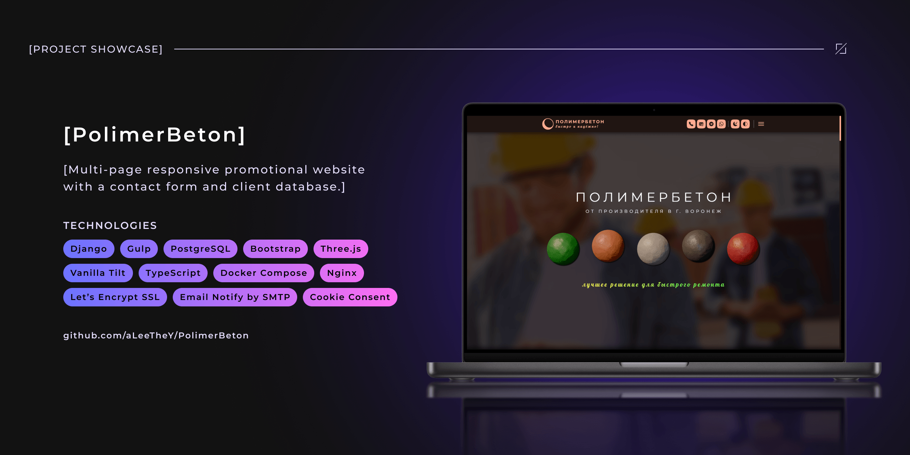
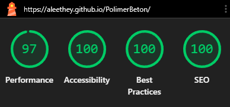
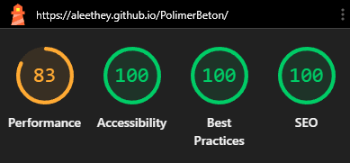

<!-- Improved compatibility of back to top link: See: https://github.com/othneildrew/Best-README-Template/pull/73 -->

<span id="readme-top"></span>

<!-- ! --- REPO SHIELDS --->
<!-- ! ---------------- --->

<div align="center">

[![Contributors][contributors-shield]][contributors-url]
[![Forks][forks-shield]][forks-url]
[![Stargazers][stars-shield]][stars-url]
[![Issues][issues-shield]][issues-url]
[![License][license-shield]][license-url]

![GitHub Last Commit][last-commit-shield]
![GitHub Repo Size][repo-size-shield]

</div>

<!-- ! --- REPO HEADER --->
<!-- ! --------------- --->

<br />
<div align="center">
  <h1 align="center">PolimerBeton</h1>

  <p align="center">
    📬 Многостраничный адаптивный рекламный сайт с формой обратной связи и базой данных клиентов.
    <br />
    <br />
    <a href="https://aleethey.github.io/PolimerBeton/">Демо</a>
    &middot;
    <a href="https://github.com/aLeeTheY/PolimerBeton/issues/new?labels=bug&template=bug-report---.md">Сообщить об ошибке</a>
  </p>

[](README.md)
[](README.ENG.md)

</div>

<!-- ! --- REPO COVER --->
<!-- ! -------------- --->


<br />

<!-- ! --- TABLE OF CONTENTS --->
<!-- ! --------------------- --->

<details>
  <summary>📦 Содержание</summary>
  <ol>
    <li>
      <a href="#about-the-project">ℹ️ О проекте</a>
      <ul>
        <li>
          <a href="#showcase">🎬 Демонстрация работы</a>
          <ul>
            <li><a href="#landing-showcase">📱 Обзор лендинга (Desktop &amp; Mobile)</a></li>
            <li><a href="#pages-showcase">🔔 Служебные страницы</a></li>
            <li><a href="#threejs-showcase">🪐 Интерактивные 3D-сферы (Three.js)</a></li>
            <li><a href="#vanilla-tilt-showcase">🃏 3D-эффект наклона карточек (Vanilla Tilt)</a></li>
            <li><a href="#fullstack-showcase">🔄 Полный цикл обработки заявки (Форма ➔ БД ➔ Email)</a></li>
          </ul>
        </li>
        <li>
          <a href="#key-features">✨ Ключевые особенности</a>
          <ul>
            <li><a href="#google-lighthouse-benchmark">⚡ Google Lighthouse Benchmark</a></li>
          </ul>
        </li>
        <li><a href="#built-with">🧰 Используемые технологии</a></li>
        <li><a href="#project-structure">📂 Структура проекта</a></li>
        <li><a href="#supported-browsers">🌐 Поддерживаемые браузеры</a></li>
      </ul>
    </li>
    <li>
      <a href="#quick-start">🚀 Начало работы</a>
      <ul>
        <li><a href="#clone-repository">1. 📥 Клонирование репозитория</a></li>
        <li><a href="#env-setup">2. 🔐 Настройка переменных окружения</a></li>
        <li>
          <a href="#deployment-methods">3. 🏗️ Выбор способа развёртывания</a>
          <ul>
            <li>
              <a href="#docker-method">🐳 Способ 1: Развёртывание через Docker Compose (рекомендуемый)</a>
              <ul>
                <li><a href="#docker-prerequisites">📋 Предварительные требования</a></li>
                <li>
                  <a href="#docker-build-launch">⚙️ Сборка и запуск контейнеров</a>
                  <ul>
                    <li><a href="#docker-create-superuser">👤 Создание суперпользователя</a></li>
                    <li><a href="#docker-troubleshooting">🛠️ Устранение проблем (опционально)</a></li>
                  </ul>
                </li>
              </ul>
            </li>
            <li>
              <a href="#native-method">💻 Способ 2: Ручное развёртывание (Native / без Docker)</a>
              <ul>
                <li><a href="#native-prerequisites">📋 Предварительные требования</a></li>
                <li><a href="#native-build-frontend">🎨 Сборка Frontend</a></li>
                <li><a href="#native-build-backend">🐍 Настройка Backend и запуск сервера</a></li>
              </ul>
            </li>
          </ul>
        </li>
      </ul>
    </li>
    <li>
      <a href="#usage">💡 Использование</a>
      <ul>
        <li><a href="#admin-panel">🎛️ Панель администратора</a></li>
      </ul>
    </li>
    <li><a href="#development-challenges">🧠 Сложности при разработке</a></li>
    <li><a href="#key-skills">📈 Полученные навыки</a></li>
    <li><a href="#roadmap">🗺️ Дорожная карта</a></li>
    <li><a href="#license">📄 Лицензия</a></li>
    <li><a href="#contact">🤝 Контакты</a></li>
    <li><a href="#acknowledgments">💖 Благодарности</a></li>
  </ol>
</details>

<!-- ! --- ABOUT THE PROJECT --->
<!-- ! --------------------- --->

## ℹ️ О проекте <span id="about-the-project"></span>

Цель проекта — создание рекламного лендинга с формой обратной связи. Сайт позволяет клиентам оставлять заявки, а владельцу — мгновенно получать уведомления о новых заказах.

> [!NOTE]
> Фронтенд-часть проекта построена на базе авторской сборки Gulp. Подробная документация по устройству пайплайна, конфигурациям и таскам доступна в репозитории:
>
> [**Wishbone-plus-Partners**](https://github.com/aLeeTheY/Wishbone-plus-Partners)

<p align="right">(<a href="#readme-top">наверх</a>)</p>

<!-- ! --- DEMO / SHOWCASE --->
<!-- ! ------------------- --->

### 🎬 Демонстрация работы <span id="showcase"></span>

Ниже представлена видеодемонстрация ключевых возможностей сайта (_нажмите на любое изображение для перехода к живому онлайн-демо_):

<div align="center">

#### 📱 Обзор лендинга (Desktop & Mobile) <span id="landing-showcase"></span>

[![Обзор лендинга][01-website-walkthrough]](https://aleethey.github.io/PolimerBeton/)

<p align="right">(<a href="#readme-top">наверх</a>)</p>

#### 🔔 Служебные страницы <span id="pages-showcase"></span>

[![Служебные страницы][02-pages-walkthrough]](https://aleethey.github.io/PolimerBeton/)

<p align="right">(<a href="#readme-top">наверх</a>)</p>

#### 🪐 Интерактивные 3D-сферы (Three.js) <span id="threejs-showcase"></span>

[![Интерактивные 3D-сферы][03-threejs-interactivity]](https://aleethey.github.io/PolimerBeton/)

<p align="right">(<a href="#readme-top">наверх</a>)</p>

#### 🃏 3D-эффект наклона карточек (Vanilla Tilt) <span id="vanilla-tilt-showcase"></span>

[![3D-эффект наклона карточек][04-vanilla-tilt-effects]](https://aleethey.github.io/PolimerBeton/)

<p align="right">(<a href="#readme-top">наверх</a>)</p>

#### 🔄 Полный цикл обработки заявки (Форма ➔ БД ➔ Email) <span id="fullstack-showcase"></span>

[![Полный цикл обработки заявки][05-fullstack-workflow]](https://aleethey.github.io/PolimerBeton/)

</div>

<p align="right">(<a href="#readme-top">наверх</a>)</p>

<!-- ! --- KEY FEATURES --->
<!-- ! ---------------- --->

### ✨ Ключевые особенности <span id="key-features"></span>

_Для удобства вся информация разбита по категориям._

<details>
  <summary>🎨 Frontend, UI & Client-Side Interactive</summary>

- **Custom UI/UX Design System:** Авторский макет страниц, спроектированный в **Figma** с использованием компонентной системы и адаптивной сетки.
- **Fluid & Responsive Layout:** Адаптивная верстка на базе **Bootstrap** и **Bootstrap Icons** с кастомными SCSS-модулями для корректного отображения на всех типах устройств.
- **Dark Mode Ecosystem:** Декларативная поддержка тёмной темы с возможностью ручного переключения и автоматическим сопоставлением с системными настройками ОС (<code encoded-by-transform-md="true">prefers&#8209;color&#8209;scheme</code>).
- **3D WebGL Graphics (Blender & Three.js):** Моделирование и UV-текстурирование 3D-сфер в **Blender** (<code encoded-by-transform-md="true">.glb</code>) с последующей асинхронной сборкой интерактивной 3D-сцены в **Three.js** и Canvas в секции Hero.
- **Micro-interactions & CSS Animations:** Объёмный 3D-эффект наклона карточек через **vanilla-tilt.js**, самостоятельные зацикленные декоративные CSS-анимации (<code encoded-by-transform-md="true">@keyframes</code>) и кастомные UI-переходы с аппаратным GPU-ускорением (<code encoded-by-transform-md="true">transform</code>, <code encoded-by-transform-md="true">will&#8209;change</code>), параллакс-эффекты и анимированный градиент в акцентных элементах. Декоративные анимации автоматически ставятся на паузу, когда элемент покидает viewport, — снижает нагрузку на CPU и экономит батарею на мобильных устройствах.
- **Input Masking & Error Pages:** Валидация пользовательского ввода на клиенте с помощью **inputmask**, а также стилизованные кастомные страницы ошибок **404** и **500** в общем стиле сайта.
- **Cookie Consent & Analytics:** Кастомный баннер управления согласием на использование cookie. Сторонние метрики (**Google Analytics + Yandex Metrica**) подключаются только после явного согласия пользователя.

</details>

<details>
  <summary>⚙️ Backend & Database Architecture</summary>

- **Django Core Architecture:** Модульная структура бэкенда (<code encoded-by-transform-md="true">MainApp</code>), управление зависимостями через **Poetry** и кастомизированная панель администратора.
- **Database Field-Level Encryption:** Шифрование чувствительных данных клиентов на уровне отдельных полей моделей **ORM** (_Object-Relational Mapping_) перед сохранением в БД.
- **Admin Panel Localization (i18n):** Локализация интерфейса панели администратора на базе системного механизма **GNU Gettext** (<code encoded-by-transform-md="true">.po</code>/<code encoded-by-transform-md="true">.mo</code>). Переводы касаются только админки — публичный сайт моноязычный (русский), так как ориентирован на российский рынок.
- **Resilient Fallback Form Validation:** Двухуровневая проверка данных — клиентская маска дополнена строгой валидацией на стороне Django, гарантирующей обработку форм даже при отключенном JavaScript.
- **Flexible Transactional Mail Pipeline:** Отправка сервисных уведомлений о заказах через два независимо конфигурируемых канала — стандартный протокол **SMTP** и **Mailjet HTTP API** (HTTPS-транспорт для VPS с заблокированными SMTP-портами). Каналы включаются через переменные окружения и могут работать как по отдельности, так и параллельно.
- **Rate-Limited Form Submission:** Антиспам-защита формы обратной связи — не более 3 отправок с одного клиента в час. Счётчик сбрасывается каждый час, при превышении лимита пользователь получает отдельную страницу <code encoded-by-transform-md="true">limit&#8209;exceeded.html</code>. Защищает от флуда и автоматизированного спама без внешних капч-сервисов.
- **Admin-Controlled Site Configuration:** Модель <code encoded-by-transform-md="true">SiteConfig</code> с редактируемыми через django-admin параметрами — официальный домен сайта и актуальная цена полимербетона. Значения прокидываются в шаблоны через контекст-процессор, что позволяет владельцу менять их без правок кода и пересборки фронтенда.

</details>

<details>
  <summary>🐳 Инфраструктура, Docker & CI/CD</summary>

- **Containerized Environments:** Мультистадийная изоляция через **Docker** и **Docker Compose** с разделением конфигураций для <code encoded-by-transform-md="true">dev</code>, <code encoded-by-transform-md="true">staging</code> и <code encoded-by-transform-md="true">prod</code> (включая профиль с поддержкой <code encoded-by-transform-md="true">SELinux</code>).
- **Nginx Reverse Proxy Stack & Automated SSL:** Динамическая маршрутизация виртуальных хостов и автоматический выпуск/продление SSL-сертификатов Let's Encrypt через сцепку **nginx-proxy**, **acme-companion** и **docker-gen**.
- **Environment Configuration Blueprints:** Шаблоны файлов <code encoded-by-transform-md="true">.env.*.template</code>, задающие структуру переменных среды для генерации целевых <code encoded-by-transform-md="true">.env</code>-конфигураций под конкретный сценарий сборки.
- **Automated SSH Deployment Workflow:** Настроенный сценарий автодеплоя через **GitHub Actions** и **SSH** для автоматического обновления контейнеров на VPS при пуше в ветку <code encoded-by-transform-md="true">main</code> _(по умолчанию отключён в текущей конфигурации репозитория)_.

</details>

<details>
  <summary>⚡ Производительность & Оптимизация ассетов</summary>

- **Progressive WebGL Initialization:** Оптимизация показателя LCP за счет разделения инициализации UI и Three.js: отложенный запуск 3D-сцены через динамические импорты (<code encoded-by-transform-md="true">import()</code>), <code encoded-by-transform-md="true">requestIdleCallback</code> и использование 2D-спрайтов в качестве легких заглушек.
- **Next-Gen Media Pipeline:** Автоматическая конвертация и отдача графики в форматах <code encoded-by-transform-md="true">.avif</code> и <code encoded-by-transform-md="true">.webp</code> с фолбеками через семантические структуры <code encoded-by-transform-md="true">&lt;picture&gt;</code>/<code encoded-by-transform-md="true">&lt;source&gt;</code>.
- **Critical CSS & Resource Prioritization:** Внедрение концепции Critical CSS для мгновенной отрисовки первого экрана, предзагрузка ключевых шрифтов <code encoded-by-transform-md="true">.woff2</code> и Hero-графики с атрибутом <code encoded-by-transform-md="true">fetchpriority="high"</code>.
- **Automated Gulp Pipeline & Nunjucks:** Сборка фронтенда на базе Gulp с компиляцией шаблонов **Nunjucks** (<code encoded-by-transform-md="true">.njk</code>) в минифицированные HTML/Django-шаблоны, быстрая сборка TypeScript через **Esbuild**, препроцессинг SCSS, оптимизация графики (**Sharp**, **SVGO**) и обработка HTML через PostHTML.

</details>

<details>
  <summary>🛡️ Качество кода & Автоматический линтинг</summary>

- **Cross-Browser Layout Inspection:** Интеграция **Playwright** для запуска изолированных браузерных движков (Chromium, WebKit, Firefox) по требованию для ручной проверки адаптивности и верстки на этапе разработки.
- **Targeted Browser Compatibility Guard:** Интеграция <code encoded-by-transform-md="true">.browserslistrc</code> со **Stylelint** (плагин <code encoded-by-transform-md="true">stylelint&#8209;no&#8209;unsupported&#8209;browser&#8209;features</code>), блокирующая коммит при использовании CSS-свойств, не поддерживаемых целевыми версиями браузеров.
- **Strict Linting & Formatting Standards:** Автоматическая проверка кода перед коммитом через **Husky**, **lint-staged**, **ESLint**, **Stylelint** и **Prettier**.
- **Conventional Commits:** Строгий контроль формата сообщений коммитов утилитой **commitlint**.

</details>

<p align="right">(<a href="#readme-top">наверх</a>)</p>

#### ⚡ Google Lighthouse Benchmark <span id="google-lighthouse-benchmark"></span>

В качестве подтверждения высокой оптимизации сайта ниже представлены результаты тестирования производительности в бенчмарке **Google Lighthouse** для десктопной и мобильной версий:

<div align="center">

|                          🖥️ Desktop Version                          |                         📱 Mobile Version                          |
| :------------------------------------------------------------------: | :----------------------------------------------------------------: |
|  |  |

</div>

<p align="right">(<a href="#readme-top">наверх</a>)</p>

<!-- ! --- BUILT WITH --->
<!-- ! -------------- --->

### 🧰 Используемые технологии <span id="built-with"></span>

_Для удобства вся информация разбита по категориям._

<details>
<summary>🎨 Frontend и инфраструктура сборки</summary>

- [![HTML5][HTML-logo]][HTML-url] <sup>— семантическая разметка и структура страниц</sup>
- [![Nunjucks][Nunjucks-logo]][Nunjucks-url] <sup>— компонентный шаблонизатор на этапе сборки (Gulp) для генерации итоговых HTML/Django-шаблонов</sup>
- [![TypeScript][TypeScript-logo]][TypeScript-url] <sup>— строгая типизация интерактивной клиентской логики</sup>
- [![Three.js][ThreeJS-logo]][ThreeJS-url] <sup>— 3D-визуализация интерактивной сцены на WebGL</sup>
- [![Sass][Sass-logo]][Sass-url] <sup>— CSS-препроцессор для архитектуры стилей по методологии BEM</sup>
- [![Bootstrap][Bootstrap-logo]][Bootstrap-url] <sup>— UI-фреймворк для адаптивной сетки и базовых компонентов</sup>
- [![Node.js][NodeJS-logo]][NodeJS-url] <sup>— runtime-окружение для инструментов сборки</sup>
  - [![Npm][Npm-logo]][Npm-url] <sup>— управление зависимостями фронтенда</sup>
  - [![Gulp][Gulp-logo]][Gulp-url] <sup>— оркестрация задач сборки, минификации и оптимизации ассетов (PostCSS, Esbuild, Sharp, SVGO)</sup>

</details>

<details>
<summary>🐍 Backend и База данных</summary>

- [![Python][Python-logo]][Python-url] <sup>— основной язык серверной логики</sup>
- [![Poetry][Poetry-logo]][Poetry-url] <sup>— детерминированное управление Python-зависимостями и виртуальным окружением</sup>
- [![Django][Django-logo]][Django-url] <sup>— веб-фреймворк для бизнес-логики, ORM и административной панели</sup>
- [![PostgreSQL][Postgres-logo]][Postgres-url] <sup>— реляционная система управления базами данных</sup>

</details>

<details>
<summary>🐳 Docker и инфраструктура деплоя</summary>

- [![Docker][Docker-logo]][Docker-url] <sup>— контейнеризация сервисов приложения</sup>
- [![Docker Compose][Docker-Compose-logo]][Docker-Compose-url] <sup>— оркестрация многоконтейнерных окружений (<code encoded-by-transform-md="true">dev</code>, <code encoded-by-transform-md="true">staging</code>, <code encoded-by-transform-md="true">prod</code>)</sup>
- [![Nginx][Nginx-logo]][Nginx-url] <sup>— обратный прокси-сервер (**nginx-proxy**) для маршрутизации трафика</sup>
- **ACME Companion** <sup>— автоматический выпуск и продление SSL-сертификатов Let's Encrypt</sup>

</details>

<details>
<summary>🛡️ Контроль качества кода (QA & Linters)</summary>

- [![EditorConfig][EditorConfig-logo]][EditorConfig-url] <sup>— единые стандарты форматирования кода в команде</sup>
- [![Browserslist][Browserslist-logo]][Browserslist-url] <sup>— единая конфигурация целевых браузеров для автопрефиксирования и валидации CSS-кода</sup>
- [![ESLint][ESLint-logo]][ESLint-url] <sup>— статический анализ и линтинг TypeScript/JavaScript</sup>
- [![Stylelint][Stylelint-logo]][Stylelint-url] <sup>— линтинг и валидация SCSS/CSS правил</sup>
- [![Prettier][Prettier-logo]][Prettier-url] <sup>— автоматическое форматирование кода</sup>
- [![Husky][Husky-logo]][Husky-url] <sup>— управление и автоматизация Git-хуков</sup>
- [![lint-staged][lint-staged-logo]][lint-staged-url] <sup>— запуск линтеров только на измененные Git-файлы перед коммитом</sup>
- [![Commitlint][Commitlint-logo]][Commitlint-url] <sup>— проверка сообщений коммитов на соответствие стандарту Conventional Commits</sup>
- [![Playwright][Playwright-logo]][Playwright-url] <sup>— кроссбраузерное тестирование интерфейса</sup>

</details>

<details>
<summary>🌿 Контроль версий и инфраструктура</summary>

- [![Git][Git-logo]][Git-url] <sup>— распределенная система контроля версий</sup>
- [![GitHub Actions][GitHubActions-logo]][GitHubActions-url] <sup>— автоматизация CI/CD пайплайнов</sup>

</details>

<details>
<summary>🖥️ Программное окружение, IDE и дизайн</summary>

- [![Blender][Blender-logo]][Blender-url] <sup>— 3D-моделирование геометрии, настройка материалов/UV-карт и экспорт моделей (.glb) для Three.js</sup>
- [![Figma][Figma-logo]][Figma-url] <sup>— проектирование UI/UX макетов и экспорт векторных/растровых ассетов</sup>
- [![Visual Studio Code][VSCode-logo]][VSCode-url] <sup>— основная IDE</sup>

</details>

<p align="right">(<a href="#readme-top">наверх</a>)</p>

<!-- ! --- PROJECT STRUCTURE --->
<!-- ! --------------------- --->

### 📂 Структура проекта <span id="project-structure"></span>

Основные каталоги и файлы проекта:

```text
PolimerBeton/
│
├── .github/
│   └── workflows/
│       └── update_website_by_ssh.prod.yml          # GitHub CI/CD сценарий: обновление сайта на хостинге при пуше в ветку `main`
│
├── .husky/                                         # Git-хуки
├── .vscode/
│
├── deploy/                                         # конфигурационные файлы веб‑сервера
│   ├── apache/                                     # конфиги Apache (если нужны для совместимости)
│   │   └── .htaccess
│   │
│   ├── nginx/                                      # основная конфигурация nginx
│   │   ├── Dockerfile
│   │   └── nginx.conf
│   │
│   ├── nginx-proxy/                                # nginx‑proxy (автоматический SSL / reverse proxy)
│   │   ├── vhost.d/
│   │   │   └── default
│   │   │
│   │   ├── .dockerignore
│   │   ├── custom.conf
│   │   └── Dockerfile
│   │
│   └── templates/                                  # шаблоны для docker‑gen (используется nginx‑proxy)
│       └── docker-gen/
│
├── docs/                                           # прочие проектные файлы
│   ├── assets/                                     # ассеты для README.md
│   ├── database/                                   # схема базы данных
│   └── utils/                                      # программные утилиты для обработки README.md
│
├── env/                                            # шаблоны файлов переменных среды (.env) для разных сценариев сборки (dev, prod, staging)
│   ├── .env.dev.template
│   ├── .env.prod.db.template
│   ├── .env.prod.proxy-companion.template
│   ├── .env.prod.template
│   ├── .env.staging.db.template
│   ├── .env.staging.proxy-companion.template
│   └── .env.staging.template
│
├── src/
│   ├── backend/
│   │   ├── apps/
│   │   │   └── MainApp/                            # исходники основного Django-приложения
│   │   │       ├── migrations/                     # миграции базы данных
│   │   │       │
│   │   │       ├── static/
│   │   │       │   └── MainApp/                    # статика сайта | генерируется при сборке
│   │   │       │       └── .gitkeep
│   │   │       │
│   │   │       ├── templates/
│   │   │       │   ├── email/
│   │   │       │   │   └── message_template.html   # шаблон электронного письма
│   │   │       │   │
│   │   │       │   ├── MainApp/                    # шаблоны основных страниц сайта (index.html, 404.html, ..., etc.) | генерируются при сборке
│   │   │       │   │   └── .gitkeep
│   │   │       │   │
│   │   │       │   └── meta/                       # meta-файлы сайта (robots.txt, humans.txt, ..., etc.) | генерируются при сборке
│   │   │       │       └── .gitkeep
│   │   │       │
│   │   │       ├── __init__.py
│   │   │       ├── admin.py                        # кастомизация панели администратора
│   │   │       ├── apps.py
│   │   │       ├── context_processors.py           # контекст‑процессоры, используемые в шаблонах
│   │   │       ├── forms.py                        # валидатор формы
│   │   │       ├── models.py                       # модели базы данных
│   │   │       ├── sitemaps.py                     # генератор sitemap.xml
│   │   │       ├── tests.py                        # файл для unit-тестов
│   │   │       ├── urls.py                         # основные url-маршруты сайта (только для приложения MainApp)
│   │   │       └── views.py                        # обработка запросов (бизнес-логика)
│   │   │
│   │   ├── config/                                 # глобальная конфигурация Django-приложения
│   │   │   ├── settings/
│   │   │   │   ├── __init__.py
│   │   │   │   ├── base.py                         # общие настройки для dev & prod
│   │   │   │   ├── dev.py                          # настройки, используемые при сборке в dev-режиме
│   │   │   │   └── prod.py                         # настройки, используемые при сборке в prod-режиме
│   │   │   │
│   │   │   ├── __init__.py
│   │   │   ├── asgi.py
│   │   │   ├── urls.py                             # глобальные url-маршруты сайта
│   │   │   └── wsgi.py
│   │   │
│   │   ├── locale/                                 # файлы переводов для админки
│   │   │   └── ru/
│   │   │       └── LC_MESSAGES
│   │   │           ├── django.mo                   # бинарник с переводами (gettext)
│   │   │           └── django.po                   # исходник с переводами (gettext)
│   │   │
│   │   ├── scripts/                                # скрипты запуска Django-приложения в Docker (dev & prod)
│   │   │   ├── entrypoint.prod.sh
│   │   │   └── entrypoint.sh
│   │   │
│   │   ├── manage.py                               # CLI-интерфейс для управления Django-проектом
│   │   ├── poetry.lock                             # зафиксированные зависимости для Python Virtual Env (.venv)
│   │   └── pyproject.toml                          # описание Python-проекта и зависимости для Python Virtual Env (.venv)
│   │
│   ├── frontend/
│   │   ├── gulp/                                   # конфигурация Gulp-сборщика
│   │   │   ├── config/                             # конфигурационные файлы (ключи CLI интерфейса, пути src/ & build/, FTP)
│   │   │   ├── helpers/                            # вспомогательные скрипты
│   │   │   │
│   │   │   └── tasks/                              # основные скрипты Gulp
│   │   │       ├── assets/                         # скрипты обработки ассетов (шрифты, векторные иконки, растровые картинки и т.д.)
│   │   │       │
│   │   │       ├── core/
│   │   │       │   ├── dev/
│   │   │       │   │   ├── server.js               # запуск dev-сервера
│   │   │       │   │   └── watch.js                # запуск watcher'ов
│   │   │       │   │
│   │   │       │   ├── clean.js                    # скрипт очистки build-файлов
│   │   │       │   └── main-tasks.js               # основные пайплайны сборки
│   │   │       │
│   │   │       ├── html/
│   │   │       ├── meta/
│   │   │       ├── scripts/
│   │   │       ├── styles/
│   │   │       └── utils/                          # скрипты с дополнительным функционалом (revison, zip и т.д.)
│   │   │
│   │   ├── src/                                    # исходники Frontend-части приложения
│   │   │   ├── assets/                             # ассеты
│   │   │   │   ├── audio/
│   │   │   │   ├── fonts/
│   │   │   │   ├── icons/
│   │   │   │   ├── images/
│   │   │   │   ├── misc/
│   │   │   │   └── videos/
│   │   │   │
│   │   │   ├── html/                               # шаблоны страниц
│   │   │   ├── i18n/                               # интернационализация / переводы
│   │   │   ├── libs/                               # js-библиотеки
│   │   │   ├── meta/                               # шаблоны meta-файлов (robots.txt, sitemap.xml, ..., etc.)
│   │   │   ├── scss/                               # стили (формат Sass)
│   │   │   ├── ts/                                 # скрипты (формат TypeScript)
│   │   │   │
│   │   │   └── site.config.json                    # конфигурации URL для различных сценариев сборки
│   │   │
│   │   ├── tests/
│   │   │   └── playwright/                         # скрипт запуска браузеров Playwright для ручного тестирования качества верстки (Chrome, Firefox & Safari)
│   │   │       ├── example.spec.ts
│   │   │       └── start_manual_website_test_in_playwright_browsers.ts
│   │   │
│   │   ├── .browserslistrc
│   │   ├── .npmrc
│   │   ├── .stylelintignore
│   │   ├── eslint.config.ts
│   │   ├── gulpfile.js
│   │   ├── package-lock.json
│   │   ├── package.json
│   │   ├── playwright.config.ts
│   │   ├── postcss.config.js
│   │   ├── posthtml.config.js
│   │   ├── stylelint.config.ts
│   │   ├── svgo.config.mjs
│   │   └── tsconfig.json
│   │
│   ├── Dockerfile                                  # сценарий сборки Docker-образа (режим dev)
│   └── Dockerfile.prod                             # сценарий сборки Docker-образа (режим prod)
│
├── .dockerignore
├── .editorconfig
├── .editorconfig-checker.json
├── .gitattributes
├── .gitignore
├── .lintstagedrc.yml
├── .npmrc
├── .prettierignore
├── .commitlint.config.ts
├── docker-compose.prod-selinux.yml
├── docker-compose.prod.yml                         # деплой в режиме продакшена
├── docker-compose.staging.yml                      # деплой в режиме пре-продакшена
├── docker-compose.yml                              # деплой в режиме разработки
├── LICENSE
├── package-lock.json
├── package.json
├── prettier.config.mts
├── README.ENG.md
├── README.md
└── tsconfig.json
```

<p align="right">(<a href="#readme-top">наверх</a>)</p>

<!-- ! --- SUPPORTED BROWSERS --->
<!-- ! ---------------------- --->

### 🌐 Поддерживаемые браузеры <span id="supported-browsers"></span>

Сайт проверен на корректность отображения и стабильность работы скриптов в актуальных версиях следующих браузеров:

- [![Google Chrome][GoogleChrome-logo]][GoogleChrome-url]
- [![Microsoft Edge][MicrosoftEdge-logo]][MicrosoftEdge-url]
- [![Yandex][Yandex-logo]][Yandex-url]
- [![Firefox][Firefox-logo]][Firefox-url]
- [![Opera][Opera-logo]][Opera-url]

> [!IMPORTANT]
> Проверено в последних стабильных версиях указанных выше браузеров на момент релиза **[3.0.0](https://github.com/aLeeTheY/PolimerBeton/releases/tag/3.0.0)**.
>
> **Дата последней проверки: 9 октября 2026**

<p align="right">(<a href="#readme-top">наверх</a>)</p>

<!-- ! --- QUICK START --->
<!-- ! --------------- --->

## 🚀 Начало работы <span id="quick-start"></span>

_Следуйте приведённым ниже инструкциям для корректного развёртывания проекта._

### 1. 📥 Клонирование репозитория <span id="clone-repository"></span>

Скачайте данный репозиторий в виде ZIP-архива или клонируйте его с помощью [Git][Git-url] и перейдите в каталог проекта:

```sh
git clone https://github.com/aLeeTheY/PolimerBeton
cd PolimerBeton/
```

<p align="right">(<a href="#readme-top">наверх</a>)</p>

### 2. 🔐 Настройка переменных окружения <span id="env-setup"></span>

Создайте конфигурационные файлы в каталоге <code encoded-by-transform-md="true">env/</code> на основе соответствующих шаблонов <code encoded-by-transform-md="true">.env.*.template</code>. Проект поддерживает три профиля окружения: **development**, **staging** и **production**.

> [!IMPORTANT]
> Сборки <code encoded-by-transform-md="true">staging</code> и <code encoded-by-transform-md="true">prod</code> рассчитаны на развёртывание на публичном сервере (VPS/VDS) с привязанным доменным именем, так как включают в себя прокси-сервер (**nginx-proxy**) и автоматический выпуск SSL-сертификатов (**acme-companion**).
> Для локальной разработки на ПК используйте <code encoded-by-transform-md="true">dev</code>-профиль (<code encoded-by-transform-md="true">docker&#8209;compose.yml</code>).

Например, для подготовки окружения **production** перейдите в каталог <code encoded-by-transform-md="true">env/</code> и скопируйте шаблоны:

```sh
cd env/

cp .env.prod.template .env.prod
cp .env.prod.db.template .env.prod.db
cp .env.prod.proxy-companion.template .env.prod.proxy-companion
```

После этого в **каждом** из созданных файлов замените значения всех переменных, содержащих плейсхолдеры вида <code encoded-by-transform-md="true">&lt;...&gt;</code>, на собственные параметры (подробные пояснения указаны в названиях самих плейсхолдеров внутри шаблонов).

Пример заполнения для файла <code encoded-by-transform-md="true">.env.prod.db</code>:

<div align="center">

| Исходное значение                                                      | Пример заполнения                   | Обязательность  |
| :--------------------------------------------------------------------- | :---------------------------------- | :-------------: |
| <code encoded-by-transform-md="true">POSTGRES_DB=polimerbeton_db__prod</code>                                    | <code encoded-by-transform-md="true">POSTGRES_DB=polimerbeton_db__prod</code> |   опционально   |
| <code encoded-by-transform-md="true">POSTGRES_USER=&lt;YOUR_DATABASE_USERNAME&gt;</code>                               | <code encoded-by-transform-md="true">POSTGRES_USER=admin</code>               | **обязательно** |
| <code encoded-by-transform-md="true">POSTGRES_PASSWORD=&lt;YOUR_DATABASE_PASSWORD__DONT_MATCH_WITH_USERNAME&gt;</code> | <code encoded-by-transform-md="true">POSTGRES_PASSWORD=qwerty123456</code>    | **обязательно** |

</div>

Далее вернитесь в корень проекта для продолжения сборки:

```sh
# Возврат в корень проекта для последующей сборки
cd ..
```

<p align="right">(<a href="#readme-top">наверх</a>)</p>

### 3. 🏗️ Выбор способа развёртывания <span id="deployment-methods"></span>

_Дальнейшая сборка зависит от ваших задач: вы можете развернуть проект в изолированных контейнерах **Docker** или запустить его **нативно** на вашей хост-машине._

#### 🐳 Способ 1: Развёртывание через Docker Compose (рекомендуемый) <span id="docker-method"></span>

##### 📋 Предварительные требования <span id="docker-prerequisites"></span>

Установите [Docker][Docker-url] и плагин [Docker Compose][Docker-Compose-url].

<p align="right">(<a href="#readme-top">наверх</a>)</p>

##### ⚙️ Сборка и запуск контейнеров <span id="docker-build-launch"></span>

Выберите предпочтительный файл конфигурации (<code encoded-by-transform-md="true">docker&#8209;compose.*.yml</code>) и запустите сборку:

```sh
# Пример для dev-конфигурации:
docker compose up -d --build

# Пример для prod-конфигурации:
docker compose -f docker-compose.prod.yml up -d --build
```

<p align="right">(<a href="#readme-top">наверх</a>)</p>

###### 👤 Создание суперпользователя <span id="docker-create-superuser"></span>

> [!NOTE]
> В режиме <code encoded-by-transform-md="true">dev</code> учётная запись администратора создаётся автоматически при старте контейнера на основе переменных <code encoded-by-transform-md="true">DJANGO_SUPERUSER_*</code>.

Для сборок <code encoded-by-transform-md="true">staging</code> и <code encoded-by-transform-md="true">prod</code> создайте **суперпользователя** административной панели Django вручную после успешного запуска контейнеров:

```sh
# Через Docker CLI по имени контейнера (prod-конфигурация):
docker exec -it polimerbeton-app--prod python manage.py createsuperuser

# Или через Docker Compose по имени сервиса (prod-конфигурация):
docker compose -f docker-compose.prod.yml exec app python manage.py createsuperuser
```

Далее следуйте инструкциям в консоли. После выполнения этих шагов проект считается успешно развёрнутым.

<p align="right">(<a href="#readme-top">наверх</a>)</p>

###### 🛠️ Устранение проблем (опционально) <span id="docker-troubleshooting"></span>

_При нехватке оперативной памяти или дискового пространства на VPS сборка может завершиться с ошибкой. В этом случае попробуйте выполнить поэтапную сборку с предварительной очисткой кэша Docker._

> [!CAUTION]
> Команды ниже удаляют неиспользуемые Docker-образы и кэш сборщика.

1. Очистите неиспользуемые образы и кэш сборщика:

```sh
docker image prune -f
docker builder prune -f
```

2. Соберите основной сервис приложения (<code encoded-by-transform-md="true">app</code>) отдельно:

```sh
docker compose -f docker-compose.prod.yml build app
```

3. Снова очистите промежуточный кэш и запустите остальные сервисы:

```sh
docker builder prune -f
docker compose -f docker-compose.prod.yml up -d
```

<p align="right">(<a href="#readme-top">наверх</a>)</p>

#### 💻 Способ 2: Ручное развёртывание (Native / без Docker) <span id="native-method"></span>

##### 📋 Предварительные требования <span id="native-prerequisites"></span>

Убедитесь, что в вашей системе установлены [Node.js][NodeJS-url], [Python][Python-url] и [Poetry][Poetry-url].

<p align="right">(<a href="#readme-top">наверх</a>)</p>

##### 🎨 Сборка Frontend <span id="native-build-frontend"></span>

В корне проекта установите NPM-зависимости и скомпилируйте фронтенд в директорию статики Django:

```sh
# Установка NPM-зависимостей
npm install

# Компиляция ассетов и шаблонов для Django
npm run django -w @polimerbeton/frontend
```

> [!IMPORTANT]
> Подробная документация по CLI-командам, таскам и структуре сборщика вынесена в репозиторий:
>
> [**Wishbone-plus-Partners**](https://github.com/aLeeTheY/Wishbone-plus-Partners).
>
> Для работы с фронтендом в режиме Hot Reload запустите <code encoded-by-transform-md="true">npm run dev &#8209;w @polimerbeton/frontend</code> в отдельном терминале.

<p align="right">(<a href="#readme-top">наверх</a>)</p>

##### 🐍 Настройка Backend и запуск сервера <span id="native-build-backend"></span>

Перейдите в директорию <code encoded-by-transform-md="true">src/backend/</code>, установите Python-зависимости и активируйте виртуальное окружение:

```sh
cd src/backend/

# Установка зависимостей через Poetry и активация .venv
poetry install
poetry shell
```

Выполните инициализацию базы данных и сборку статики:

```sh
# Создание миграций БД (при необходимости)
python manage.py makemigrations

# Применение миграций БД
python manage.py migrate

# Сборка статических файлов
python manage.py collectstatic --noinput
```

Создайте учётную запись администратора Django:

```sh
python manage.py createsuperuser
```

Запустите локальный сервер разработки:

```sh
python manage.py runserver
```

По умолчанию тестовый сервер будет доступен по адресу <code encoded-by-transform-md="true">http://localhost:8000/</code> (<code encoded-by-transform-md="true">http://127.0.0.1:8000/</code>).

<p align="right">(<a href="#readme-top">наверх</a>)</p>

<!-- ! --- USAGE --->
<!-- ! --------- --->

## 💡 Использование <span id="usage"></span>

После завершения этапа [**Начало работы**](#quick-start) проект будет доступен по вашему доменному имени (или на <code encoded-by-transform-md="true">http://localhost:8000/</code>, если используется конфигурация для разработки).

<p align="right">(<a href="#readme-top">наверх</a>)</p>

### 🎛️ Панель администратора <span id="admin-panel"></span>

Для доступа к административному интерфейсу перейдите на страницу <code encoded-by-transform-md="true">/admin/</code>:

```
https://your-domain.com/admin/
```

Для входа используйте учётные данные суперпользователя. Если суперпользователь ещё не создан, воспользуйтесь инструкцией из раздела [Создание суперпользователя](#docker-create-superuser).

<p align="right">(<a href="#readme-top">наверх</a>)</p>

<!-- ! --- DEVELOPMENT CHALLENGES --->
<!-- ! -------------------------- --->

## 🧠 Сложности при разработке <span id="development-challenges"></span>

- **Интеграция Gulp-пайплайна с Django:** Проектирование сквозного сборщика фронтенда (SCSS, TypeScript, Nunjucks, оптимизация ассетов) с генерацией валидных Django-шаблонов. Изоляция управляющих конструкций Django через механизмы экранирования (<code encoded-by-transform-md="true"></code>) и организация бесшовной передачи скомпилированных ассетов в структуру <code encoded-by-transform-md="true">MainApp/static/</code> и <code encoded-by-transform-md="true">MainApp/templates/</code>.
- **Прогрессивная инициализация WebGL и оптимизация LCP:** Разделение жизненного цикла UI на критический и тяжелый. Запуск базового UI по <code encoded-by-transform-md="true">DOMContentLoaded</code>, отложенный запуск Three.js через динамические импорты (<code encoded-by-transform-md="true">import()</code>) со стратегией адаптивных задержек после <code encoded-by-transform-md="true">window.load</code> (2500 мс для Mobile для сохранения показателей LCP, 1000 мс для Desktop) и фоновая подгрузка модулей через <code encoded-by-transform-md="true">requestIdleCallback</code>. Использование 2D-спрайтов в качестве легких заглушек до монтирования Canvas.
- **Оркестрация контейнеров и сетевая изоляция:** Проектирование отказоустойчивого взаимодействия между изолированными сервисами (Django, PostgreSQL, Nginx-proxy, ACME Companion) в единой сети Docker с правильным распределением volumes для сертификатов и статики.
- **Селективный CI/CD деплой:** Настройка пайплайна в GitHub Actions для бесшовного обновления ветки <code encoded-by-transform-md="true">main</code> с пересборкой _только_ контейнера Django, не затрагивая базу данных и прокси-сервер.
- **SEO и производительность (Google Lighthouse):** Глубокий аудит и оптимизация HTML-структуры, критического CSS и ассетов. Итог: **Accessibility / Best Practices / SEO — 100/100** на обеих платформах, **Performance — 97 (Desktop) и 83 (Mobile)**.
- **Гибкая доставка писем:** Модуль отправки уведомлений с двумя независимо конфигурируемыми каналами — стандартный **SMTP** и **Mailjet HTTP API**. Каждый канал включается/отключается отдельно через переменные окружения на этапе сборки: их можно использовать по одиночке, одновременно или отключить оба. Mailjet-канал (поверх HTTPS) решает проблему VPS с заблокированными SMTP-портами (25 / 465 / 587).

<p align="right">(<a href="#readme-top">наверх</a>)</p>

<!-- ! --- KEY SKILLS --->
<!-- ! -------------- --->

## 📈 Полученные навыки <span id="key-skills"></span>

- **UI/UX дизайн и адаптивная верстка:** Проектирование компонентных макетов в **Figma**, построение масштабируемой CSS-архитектуры по методологии **BEM** и создание адаптивных интерфейсов на **Bootstrap** с поддержкой тёмной темы.
- **Fullstack разработка:** Построение серверной логики на **Django**, интеграция с **PostgreSQL**, реализация шифрования чувствительных данных на уровне ORM-моделей и разработка строго типизированных клиентских скриптов на **TypeScript**.
- **3D-моделирование и WebGL (Blender & Three.js):** Моделирование геометрии сфер, наложение UV-текстур и экспорт <code encoded-by-transform-md="true">.glb</code>-файлов в **Blender**; асинхронная сборка 3D-сцены в Three.js с использованием динамических импортов (<code encoded-by-transform-md="true">import()</code>), <code encoded-by-transform-md="true">requestIdleCallback</code> и адаптивных таймаутов для защиты метрик загрузки (LCP/FCP).
- **Автоматизация сборки (Gulp Pipeline):** Создание с нуля комплексного Gulp-сборщика для компиляции шаблонов **Nunjucks** в Django-шаблоны, сборки TS через **Esbuild**, оптимизации растровой/векторной графики (**Sharp**, **SVGO**) и генерации форматов <code encoded-by-transform-md="true">.avif</code>/<code encoded-by-transform-md="true">.webp</code>.
- **DevOps и контейнеризация:** Проектирование мультиконтейнерных окружений в **Docker** и **Docker Compose** (<code encoded-by-transform-md="true">dev</code>, <code encoded-by-transform-md="true">staging</code>, <code encoded-by-transform-md="true">prod</code>), настройка изолированных сетей, монтирования томов и поддержка конфигураций с <code encoded-by-transform-md="true">SELinux</code>.
- **Обратный прокси и SSL:** Настройка **Nginx-proxy** для маршрутизации трафика и автоматизация выпуска/продления SSL-сертификатов Let's Encrypt через **ACME Companion**.
- **CI/CD Автоматизация:** Настройка селективного автодеплоя через **GitHub Actions** и **SSH** для бесшовного обновления Django-контейнера на VPS без простоя базы данных и прокси-сервера.
- **Оптимизация производительности (Lighthouse):** Внедрение концепции Critical CSS, предзагрузка ключевых ресурсов (<code encoded-by-transform-md="true">fetchpriority</code>, <code encoded-by-transform-md="true">.woff2</code>) и ассетов. Итог по метрикам **Accessibility / Best Practices / SEO — 100/100** на обеих платформах, **Performance — 97 (Desktop) и 83 (Mobile)**.
- **Контроль качества кода (QA & DX):** Настройка единой конфигурации целевых браузеров (**Browserslist**) для сквозной валидации CSS/JS, автоматическая проверка перед коммитами (**Husky**, **lint-staged**, **ESLint**, **Stylelint**, **Prettier**, **Commitlint**) и интеграция **Playwright** для кроссбраузерной проверки верстки.

<p align="right">(<a href="#readme-top">наверх</a>)</p>

<!-- ! --- ROADMAP --->
<!-- ! ----------- --->

## 🗺️ Дорожная карта <span id="roadmap"></span>

- [x] Проектирование и верстка интерфейсов в **Figma:**
  - [x] Основные страницы (<code encoded-by-transform-md="true">index.html</code>, <code encoded-by-transform-md="true">privacy.html</code>)
  - [x] Страницы ответов сервера (<code encoded-by-transform-md="true">404.html</code>, <code encoded-by-transform-md="true">500.html</code>)
  - [x] Страницы статусов обработки форм (<code encoded-by-transform-md="true">success.html</code>, <code encoded-by-transform-md="true">fail.html</code>, <code encoded-by-transform-md="true">updated.html</code>, <code encoded-by-transform-md="true">limit&#8209;exceeded.html</code>)
  - [x] Шаблон системных HTML-писем для e-mail уведомлений
- [x] Адаптивная верстка на **Bootstrap** (методология **BEM**, поддержка тёмной темы, CSS-анимации)
- [x] Интеграция динамических UI-компонентов:
  - [x] Интерактивная 3D-сцена со сферами на **Three.js** с отложенной инициализацией
  - [x] 3D-эффекты наведения на карточки в секциях _Examples_ и _Legal_ (**Vanilla Tilt**)
- [x] Автоматизация сборки фронтенда на **Gulp 5** (Nunjucks, Sass, TypeScript, оптимизация ассетов)
- [x] Инфраструктура качества кода (Code Quality & DX):
  - [x] Автоматическая проверка коммитов через Git-хуки (**Husky**, **lint-staged**, **commitlint**)
  - [x] Статический анализ и форматирование кода (**ESLint**, **Stylelint** + **Browserslist**, **Prettier**, **EditorConfig**)
  - [x] Кроссбраузерное ручное и автоматизированное тестирование интерфейса с помощью **Playwright**
- [x] Интеграция верстки в шаблоны **Django**
- [x] Проектирование архитектуры БД в **PostgreSQL** (клиенты и заявки на обратный звонок)
- [x] Кастомизация панели администратора (**django-admin**) под текущие модели данных
- [x] Интернационализация и локализация панели администратора
- [x] SEO-оптимизация: динамическая генерация карты сайта (**Django Sitemaps**) и конфигурация поисковых файлов (<code encoded-by-transform-md="true">robots.txt</code>, <code encoded-by-transform-md="true">humans.txt</code>)
- [x] Подсистема обработки форм: клиентская маска ввода (**Inputmask**), серверная валидация Django, индикация загрузки (UI-states) и уведомления о статусе отправки
- [x] Антиспам-механизм формы: ограничение 3 отправок в час с автосбросом счётчика
- [x] Разработка сервиса отправки HTML-уведомлений по протоколу **SMTP** через Django-шаблоны
- [x] Разработка альтернативного сервиса уведомлений через **Mailjet** API
- [x] Внедрение механизмов **шифрования и защиты персональных данных**
- [x] Реализация механизма управления пользовательским согласием (**Cookie Consent**)
- [x] Интеграция сторонних метрик (**Google Analytics + Yandex Metrica**) с соблюдением политики Cookie
- [x] Контейнеризация и деплой с использованием **Docker:**
  - [x] Конфигурация сред окружения (<code encoded-by-transform-md="true">.env.dev</code>, <code encoded-by-transform-md="true">.env.staging</code>, <code encoded-by-transform-md="true">.env.prod</code> с шаблонами под DB и Proxy-companion)
  - [x] Подготовка конфигураций **Dockerfile** и **Dockerfile.prod** под задачи dev и prod окружений
  - [x] Оркестрация контейнеров (**Django**, **PostgreSQL**, **Nginx-proxy**, **ACME Companion**) через <code encoded-by-transform-md="true">docker&#8209;compose</code> (поддержка <code encoded-by-transform-md="true">dev</code>, <code encoded-by-transform-md="true">staging</code>, <code encoded-by-transform-md="true">prod</code> и режимов **SELinux**)
  - [x] Настройка веб-сервера **Nginx** (reverse proxy) и автоматизация SSL-сертификатов через **ACME Companion** (Let's Encrypt)
- [x] Автоматизация **CI/CD** через **GitHub Actions:**
  - [x] Автоматическая сборка и деплой при обновлении ветки <code encoded-by-transform-md="true">main</code> (по умолчанию отключено, см. выше)

Полный список планируемых функций и известных проблем доступен в разделе [Issues][issues-url].

<p align="right">(<a href="#readme-top">наверх</a>)</p>

<!-- ! --- LICENSE --->
<!-- ! ----------- --->

## 📄 Лицензия <span id="license"></span>

Copyright © 2024–2026 [aLeeTheY](https://github.com/aLeeTheY)

Проект распространяется по лицензии [**PolyForm Noncommercial License 1.0.0**](https://polyformproject.org/licenses/noncommercial/1.0.0) и открыт для личного использования, обучения, исследований и некоммерческих целей. Коммерческое использование, перепродажа или использование в коммерческих продуктах запрещены.

Подробные условия и ограничения описаны в файле [<code encoded-by-transform-md="true">LICENSE</code>][license-url].

<p align="right">(<a href="#readme-top">наверх</a>)</p>

<!-- ! --- CONTACT --->
<!-- ! ----------- --->

## 🤝 Контакты <span id="contact"></span>

<!-- [![GitHub][GitHub-logo]](https://github.com/aLeeTheY)
[![Telegram][Telegram-logo]](https://t.me/aLeeTheY)
[![Gmail][Gmail-logo]](mailto:aleethey@gmail.com) -->

GitHub: [aLeeTheY](https://github.com/aLeeTheY)
<br/>
Telegram: [@aLeeTheY](https://t.me/aLeeTheY)
<br/>
Email: [aleethey@gmail.com](mailto:aleethey@gmail.com)

<p align="right">(<a href="#readme-top">наверх</a>)</p>

<!-- ! --- ACKNOWLEDGMENTS --->
<!-- ! ------------------- --->

## 💖 Благодарности <span id="acknowledgments"></span>

[aLeeTheY](https://github.com/aLeeTheY) выражает благодарность разработчикам и сообществам следующих проектов:

- [Blender](https://www.blender.org/)
- [Figma](https://www.figma.com/)
- [Visual Studio Code](https://code.visualstudio.com/)
- [Python](https://www.python.org/)
- [Poetry](https://python-poetry.org/)
- [Django](https://www.djangoproject.com/)
- [PostgreSQL](https://www.postgresql.org/)
- [TypeScript](https://www.typescriptlang.org/)
- [Three.js](https://threejs.org/)
- [Sass](https://sass-lang.com/)
- [Bootstrap](https://getbootstrap.com/)
- [Bootstrap Icons](https://icons.getbootstrap.com/)
- [Nunjucks](https://mozilla.github.io/nunjucks/)
- [Node.js](https://nodejs.org/)
- [Npm](https://www.npmjs.com/)
- [Gulp](https://gulpjs.com/)
- [Esbuild](https://esbuild.github.io/)
- [Sharp](https://sharp.pixelplumbing.com/)
- [SVGO](https://github.com/svg/svgo)
- [PostCSS](https://postcss.org/)
- [PostHTML](https://github.com/posthtml/posthtml)
- [EditorConfig](https://editorconfig.org/)
- [Browserslist](https://github.com/browserslist/browserslist)
- [ESLint](https://eslint.org/)
- [Stylelint](https://stylelint.io/)
- [Prettier](https://prettier.io/)
- [Husky](https://typicode.github.io/husky/)
- [lint-staged](https://github.com/lint-staged/lint-staged)
- [Commitlint](https://commitlint.js.org/)
- [Playwright](https://playwright.dev/)
- [Docker](https://www.docker.com/)
- [Docker Compose](https://docs.docker.com/compose/)
- [Nginx](https://nginx.org/)
- [nginx-proxy](https://github.com/nginx-proxy/nginx-proxy)
- [docker-gen](https://github.com/nginx-proxy/docker-gen)
- [ACME Companion](https://github.com/nginx-proxy/acme-companion)
- [Let's Encrypt](https://letsencrypt.org/)
- [Git](https://git-scm.com/)
- [GitHub](https://github.com/)
- [GitHub Actions](https://github.com/features/actions)
- [PolyForm Project](https://polyformproject.org/)
- [Mailjet](https://www.mailjet.com/)
- [Chocolatey](https://chocolatey.org/)
- [FFmpeg](https://www.ffmpeg.org/)
- [gifsicle](https://github.com/kohler/gifsicle)
- [Chrome DevTools](https://developer.chrome.com/docs/devtools)
- [Lighthouse](https://developer.chrome.com/docs/lighthouse/overview)

Без этих инструментов разработка данного проекта была бы **невозможна**.

<p align="right">(<a href="#readme-top">наверх</a>)</p>

<!-- ! --- MARKDOWN LINKS --->
<!-- ! ------------------ --->

<!-- * shields --->

[contributors-shield]: https://img.shields.io/github/contributors/aLeeTheY/PolimerBeton.svg?style=for-the-badge
[contributors-url]: https://github.com/aLeeTheY/PolimerBeton/graphs/contributors
[forks-shield]: https://img.shields.io/github/forks/aLeeTheY/PolimerBeton.svg?style=for-the-badge
[forks-url]: https://github.com/aLeeTheY/PolimerBeton/network/members
[stars-shield]: https://img.shields.io/github/stars/aLeeTheY/PolimerBeton.svg?style=for-the-badge
[stars-url]: https://github.com/aLeeTheY/PolimerBeton/stargazers
[issues-shield]: https://img.shields.io/github/issues/aLeeTheY/PolimerBeton.svg?style=for-the-badge
[issues-url]: https://github.com/aLeeTheY/PolimerBeton/issues
[last-commit-shield]: https://img.shields.io/github/last-commit/aLeeTheY/PolimerBeton?style=for-the-badge
[repo-size-shield]: https://img.shields.io/github/repo-size/aLeeTheY/PolimerBeton?style=for-the-badge

<!-- [license-shield]: https://img.shields.io/github/license/aLeeTheY/PolimerBeton.svg?style=for-the-badge -->

[license-shield]: https://img.shields.io/badge/License-PolyForm_Noncommercial-critical?style=for-the-badge
[license-url]: https://github.com/aLeeTheY/PolimerBeton/blob/main/LICENSE

<!-- * techologies --->

[HTML-logo]: https://img.shields.io/badge/HTML-%23E34F26.svg?logo=html5&logoColor=white&style=for-the-badge
[HTML-url]: https://html.spec.whatwg.org/
[Nunjucks-logo]: https://custom-icon-badges.demolab.com/badge/Nunjucks-3d8137?logo=nunjucks&style=for-the-badge
[Nunjucks-url]: https://mozilla.github.io/nunjucks/
[Sass-logo]: https://img.shields.io/badge/Sass-C69?logo=sass&logoColor=fff&style=for-the-badge
[Sass-url]: https://sass-lang.com/
[Bootstrap-logo]: https://img.shields.io/badge/Bootstrap-7952B3?logo=bootstrap&logoColor=fff&style=for-the-badge
[Bootstrap-url]: https://getbootstrap.com/
[TypeScript-logo]: https://img.shields.io/badge/TypeScript-3178C6?logo=typescript&logoColor=fff&style=for-the-badge
[TypeScript-url]: https://www.typescriptlang.org/
[Python-logo]: https://img.shields.io/badge/Python-3776AB?logo=python&logoColor=fff&style=for-the-badge
[Python-url]: https://www.python.org/
[Django-logo]: https://img.shields.io/badge/Django-%23092E20.svg?logo=django&logoColor=white&style=for-the-badge
[Django-url]: https://www.djangoproject.com/
[Poetry-logo]: https://custom-icon-badges.demolab.com/badge/Poetry-1F293A?logo=poetry&style=for-the-badge
[Poetry-url]: https://python-poetry.org/
[Docker-logo]: https://img.shields.io/badge/Docker-2496ED?logo=docker&logoColor=fff&style=for-the-badge
[Docker-url]: https://www.docker.com/
[Docker-Compose-logo]: https://img.shields.io/badge/Docker-Compose-blue?style=for-the-badge&logo=docker&logoColor=white
[Docker-Compose-url]: https://docs.docker.com/compose/
[Postgres-logo]: https://img.shields.io/badge/Postgres-%23316192.svg?logo=postgresql&logoColor=white&style=for-the-badge
[Postgres-url]: https://www.postgresql.org/
[Git-logo]: https://img.shields.io/badge/Git-F05032?logo=git&logoColor=fff&style=for-the-badge
[Git-url]: https://git-scm.com/
[Nginx-logo]: https://img.shields.io/badge/nginx-009639?logo=nginx&logoColor=fff&style=for-the-badge
[Nginx-url]: https://nginx.org/
[GitHubActions-logo]: https://img.shields.io/badge/GitHub_Actions-2088FF?logo=github-actions&logoColor=white&style=for-the-badge
[GitHubActions-url]: https://github.com/features/actions
[NodeJS-logo]: https://img.shields.io/badge/Node.js-6DA55F?logo=node.js&logoColor=white&style=for-the-badge
[NodeJS-url]: https://nodejs.org/
[Npm-logo]: https://img.shields.io/badge/npm-CB3837?logo=npm&logoColor=fff&style=for-the-badge
[Npm-url]: https://www.npmjs.com/
[Gulp-logo]: https://img.shields.io/badge/GULP-%23CF4647.svg?style=for-the-badge&logo=gulp&logoColor=white
[Gulp-url]: https://gulpjs.com/
[Browserslist-logo]: https://custom-icon-badges.demolab.com/badge/browserslist-1d1d1d?logo=browserslist&style=for-the-badge
[Browserslist-url]: https://github.com/browserslist/browserslist
[ThreeJS-logo]: https://img.shields.io/badge/threedotjs-%23000000.svg?style=for-the-badge&logo=threedotjs&logoColor=white
[ThreeJS-url]: https://threejs.org/

<!-- * linters & code format --->

[ESLint-logo]: https://img.shields.io/badge/ESLint-4B3263?style=for-the-badge&logo=eslint&logoColor=white
[ESLint-url]: https://eslint.org/
[Stylelint-logo]: https://custom-icon-badges.demolab.com/badge/Stylelint-1b1b1d?logo=stylelint&style=for-the-badge
[Stylelint-url]: https://stylelint.io/
[Prettier-logo]: https://img.shields.io/badge/prettier-%23192a32?style=for-the-badge&logo=prettier&logoColor=dc524a
[Prettier-url]: https://prettier.io/
[EditorConfig-logo]: https://custom-icon-badges.demolab.com/badge/EditorConfig-010101?logo=editorconfig&style=for-the-badge
[EditorConfig-url]: https://editorconfig.org/
[Commitlint-logo]: https://custom-icon-badges.demolab.com/badge/Commitlint-1b1b1f?logo=commitlint&style=for-the-badge
[Commitlint-url]: https://commitlint.js.org/
[lint-staged-logo]: https://custom-icon-badges.demolab.com/badge/Lint--Staged-ffffff?logo=lintstaged&style=for-the-badge
[lint-staged-url]: https://github.com/lint-staged/lint-staged
[Husky-logo]: https://custom-icon-badges.demolab.com/badge/Husky-607d8b?logo=husky-vscode&style=for-the-badge
[Husky-url]: https://typicode.github.io/husky/
[Playwright-logo]: https://custom-icon-badges.demolab.com/badge/Playwright-242526?logo=playwright&style=for-the-badge
[Playwright-url]: https://playwright.dev/

<!-- * ide & workspace --->

[VSCode-logo]: https://custom-icon-badges.demolab.com/badge/VSCODE-0d1014?logo=vscode&logoColor=white&style=for-the-badge
[VSCode-url]: https://code.visualstudio.com/
[Figma-logo]: https://img.shields.io/badge/figma-%23F24E1E.svg?style=for-the-badge&logo=figma&logoColor=white
[Figma-url]: https://www.figma.com/
[Blender-logo]: https://img.shields.io/badge/blender-%23F5792A.svg?style=for-the-badge&logo=blender&logoColor=white
[Blender-url]: https://www.blender.org/

<!-- * browsers --->

[Opera-logo]: https://img.shields.io/badge/Opera-FF1B2D?logo=Opera&logoColor=white&style=for-the-badge
[Opera-url]: https://www.opera.com/
[GoogleChrome-logo]: https://img.shields.io/badge/Google%20Chrome-4285F4?logo=GoogleChrome&logoColor=white&style=for-the-badge
[GoogleChrome-url]: https://www.google.com/chrome/
[MicrosoftEdge-logo]: https://custom-icon-badges.demolab.com/badge/Microsoft%20Edge-2771D8?logo=edge-white&logoColor=white&style=for-the-badge
[MicrosoftEdge-url]: https://www.microsoft.com/en-us/edge/
[Firefox-logo]: https://img.shields.io/badge/Firefox-FF7139?logo=firefoxbrowser&logoColor=white&style=for-the-badge
[Firefox-url]: https://www.firefox.com/
[Yandex-logo]: https://custom-icon-badges.demolab.com/badge/Yandex%20Browser-F03911?logo=yandex-browser&style=for-the-badge
[Yandex-url]: https://browser.yandex.com/

<!-- * other --->

<!-- [Mailjet-url]: https://www.mailjet.com/
[Vanilla-Tilt-url]: https://github.com/micku7zu/vanilla-tilt.js/ -->

<!-- * contacts --->

<!-- [GitHub-logo]: https://img.shields.io/badge/github-%23121011.svg?style=for-the-badge&logo=github&logoColor=white
[Telegram-logo]: https://img.shields.io/badge/Telegram-2CA5E0?style=for-the-badge&logo=telegram&logoColor=white
[Gmail-logo]: https://img.shields.io/badge/Gmail-D14836?style=for-the-badge&logo=gmail&logoColor=white -->

<!-- ! --- MARKDOWN ASSETS --->
<!-- ! ------------------- --->

[01-website-walkthrough]: docs/assets/01__website_walkthrough.gif
[02-pages-walkthrough]: docs/assets/02__pages_walkthrough.gif
[03-threejs-interactivity]: docs/assets/03__threejs_interactivity.gif
[04-vanilla-tilt-effects]: docs/assets/04__vanilla_tilt_effects.gif
[05-fullstack-workflow]: docs/assets/05__fullstack_workflow.gif
